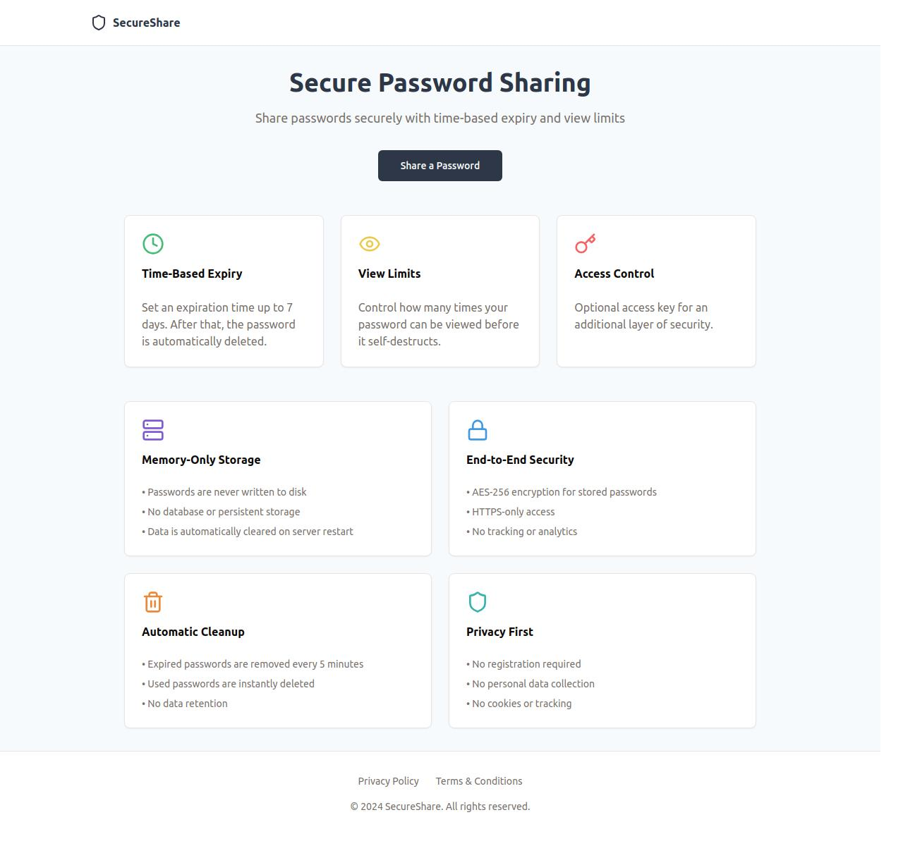

# SecureShare  

A privacy-first, self-destructing password-sharing service.  

## Features  

- ✅ **End-to-End Encryption** – AES-256 encryption ensures secure password storage.  
- ✅ **Time-Based Expiry** – Passwords auto-delete after up to 7 days.  
- ✅ **View Limits** – Set how many times a password can be accessed before deletion.  
- ✅ **Access Control** – Optional access keys for extra security.  
- ✅ **Memory-Only Storage** – No persistent database; all data is volatile.  
- ✅ **Zero Tracking** – No accounts, no logs, no cookies, no analytics.  
- ✅ **Instant Deletion** – Users can manually delete passwords at any time.  

---

## How It Works  

1. **Enter a password** you want to share.  
2. **Set an expiry time** (up to 7 days) and optional view limit.  
3. **Generate a secure link** to share with others.  
4. **Once the limit is reached or time expires**, the password is permanently deleted.

# SecureShare  


---

## Tech Stack  

- **Frontend**: Vite.js (React/Vue/Svelte)  
- **Backend**: Node.js (Express)  
- **Encryption**: AES-256 for password security  
- **Storage**: Memory-based, no database  

---

## Installation & Setup  

### Prerequisites  

- Node.js (v18+ recommended)  
- npm or yarn  

### Installation Steps  

1. Clone the repository:  
   ```bash
   git clone https://github.com/yourusername/SecureShare.git
   cd SecureShare
   ```  
2. Install dependencies:  
   ```bash
   npm install  # or yarn install
   ```  
3. Start the development server:  
   ```bash
   npm run dev  # or yarn dev
   ```  
4. Open in your browser:  
   ```
   http://localhost:5000
   ```  

---

## Building for Production  

To build the project for production:  
```bash
npm run build  # or yarn build
```  
This generates optimized static files in the `dist/` folder.  

To serve the built project:  
```bash
npm run preview  # or yarn preview
```  

---

## Deployment  

You can deploy SecureShare on:  

- **Railway.app**  
- **Render.com**
- **Heroku** 
- **AWS Lambda + API Gateway**  

---

## Security & Privacy  

🔒 **AES-256 Encryption** – All stored passwords are encrypted.  
🚫 **No Backups** – Deleted passwords cannot be recovered.  
🛑 **No Tracking** – No logs, cookies, or analytics.  
⏳ **Automated Cleanup** – Expired passwords are purged every 5 minutes.  
🛠️ **Open Source** – Transparent code for full auditability.  

---

## Attribution  

SecureShare is developed and maintained by **Sanyam**.  
If you use this project, consider linking back to:  
🔗 **GitHub Repo:** (https://github.com/Sanyam4007/SecureShare.git)  

---

## Contributing  

💡 Found a bug or have an idea? Open an issue or submit a pull request!  

---

## License  

This project is licensed under the **MIT License** – free to use and modify.  

---

## Contact  

For any questions or security concerns, reach out at **hello@sanyam14.me**.  
